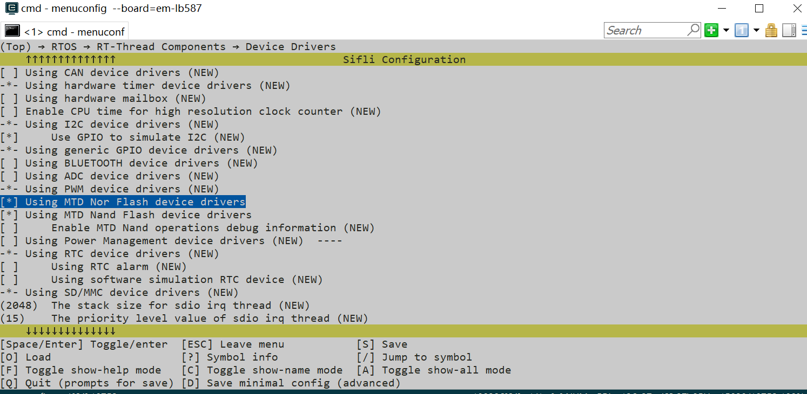
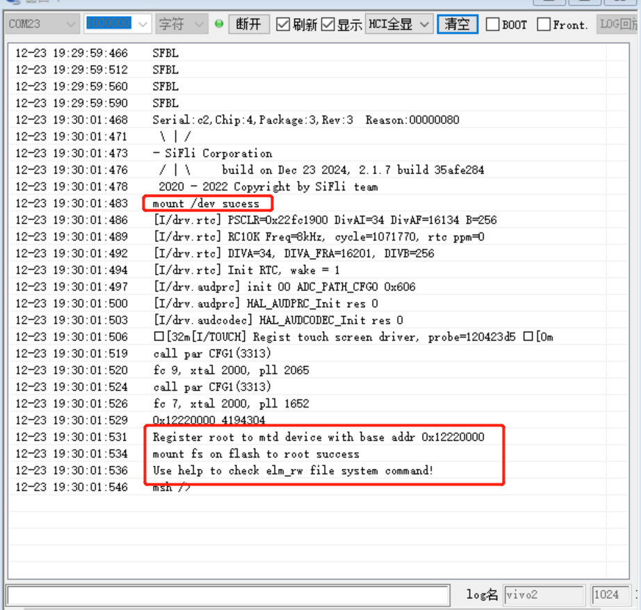
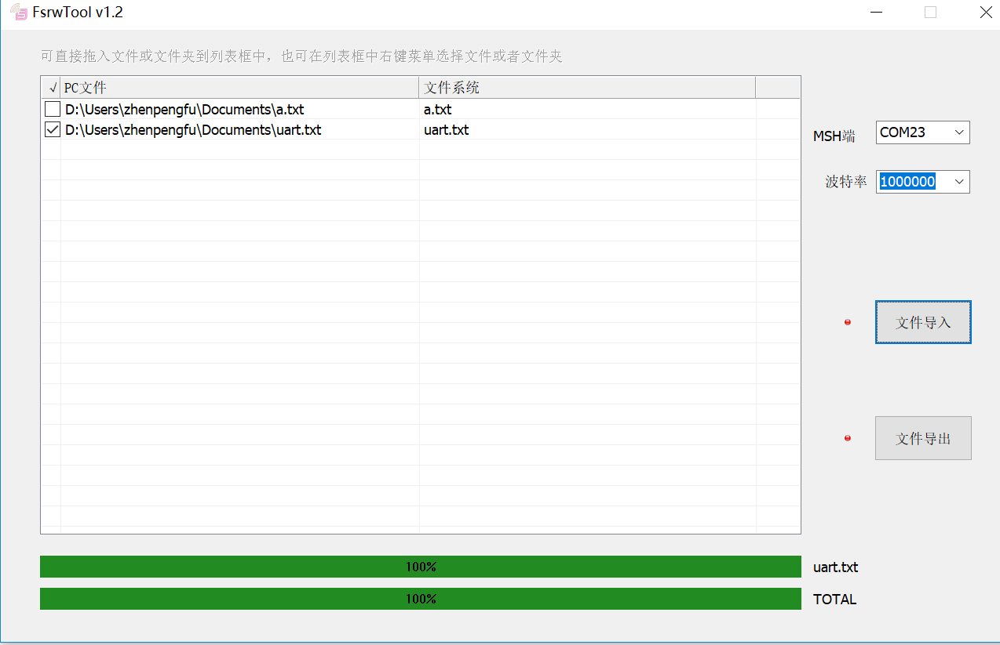
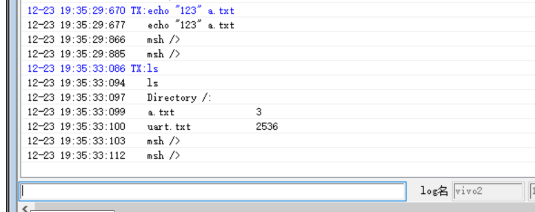
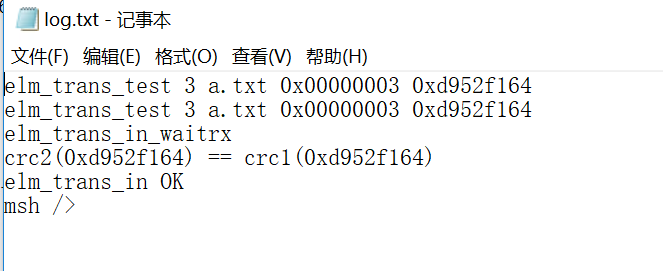

# ELM_RW示例
## 概述
例程展示了使用ELM进行文件数据读传输操作，搭配FsrwTool进行可视化文件传输。

## 支持的开发板
例程可以运行在以下开发板.<br>
* em-lb525
* em-lb587


**注意：** 一般而言，例程都是运行芯片的HCPU，"eh-lb563_v2" 等效于"eh-lb563_v2_hcpu"，如果想在LCPU运行例程，可以使用"eh-lb563_v2_lcpu"。目前USB功能暂时只支持在HCPU上运行。

## 例程目录结构
ELM_RW工程包含了1个.c文件(main.c),下面的树状结构展示 了工程目录下的其他文件.
```c
|--README.md
|--src
|    |--main.c
|    |--Sconscript
|--project  
        |--Kconfig
        |--Kconfig.proj
        |--proj.conf
        |--rtconfig.py
        |--SConscript
        |--SConstruct
```
## 例程的使用
### 硬件需求
1、运行例程的前提，需要拥有一块支持该例程的开发板。
2、一根具备数据传输能力的USB数据线。


### menuconfig配置
```c
//指令执行
 menuconfig --board=em-lb525
```
#### menuconfig配置1
控制是否编译和启用对 NOR Flash 设备的支持。

#### menuconfig配置2
启用Device File System (DFS) 和 ELM FAT文件系统的支持。DFS是RT-Thread操作系统中的一个抽象层，用于统一管理不同类型的文件系统。

#### menuconfig配置3
启用ELM模块的读写功能。


### 编译和烧录
按照以下步骤，可以完成编译和烧录。

> scons --board=em-lb525 

> .\build_em-lb525\uart_download.bat

## 例程输出结果展示
下面结果展示了例程在开发板运行起来后的log。如
系统启动

 > mount /dev sucess\
 > mount fs on flash to root success\
 > Use help to check elm_rw file system command!\
 > msh />




## FsrwTool交互使用
* 工具在tools\FsrwTool目录下


### 文件导入：
我们将想要导入的文件拖入例表框中，点击文件导入，注意串口连接及波特率配置


### 查看已经导入的文件信息：
使用命令`ls`可以查看文件信息，示例中的a.txt无内容所以显示0字符，使用`echo "123" a.txt`命令进行文件内容添加，引号中为想加入文件中的字符内容


### 文件导出：
* FsrwTool文件导出并不是将开发板中的文件移动出来，而是复制一份出来（板子内还会存留之前导入的文件）
* 可以看到添加内容后打开的a.txt文件内容已经改变

### 文件删除：
* 输入`rm file`可以将导入开发板的文件删除


### FsrwTool-log
* 文件导入的log



* 文件添加内容导出的log


 ## 故障排除
如果未能出现预期的log，可以从以下方面进行故障排除：
* 硬件连接是否正常
* menuconfig配置是否设置
* 开发板flash是否正常
* 导入，导出的文件是否为空或者重复


