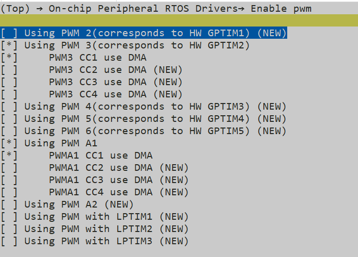

# PWM_DMA示例

源码路径：example\rt_device\pwm
## 支持的平台
例程可以运行在以下开发板.
* em-lb525
* em-lb587
## 概述
* 包含了Gtime,Atime使用pwm+dma功能通过IO口输出PWM波形的示例


## 例程的使用
### 硬件需求
运行该例程前，需要准备一块本例程支持的开发板（[支持的平台](#支持的平台)）


### menuconfig配置
em-lb525的menuconfig配置

em-lb587的menuconfig配置

**注意**: pwm设置已经是设置TIM配置，注意检查Enable timer配置是否造成冲突


类似冲突错误：


### 编译和烧录
切换到例程project目录，运行scons命令执行编译：

```
scons --board=em-lb525 -j8
```

运行`build_em-lb525_hcpu\uart_download.bat`，按提示选择端口即可进行下载：

```
build_em-lb525_hcpu\uart_download.bat

Uart Download

please input the serial port num:5
```

关于编译、下载的详细步骤，请参考[](/quickstart/get-started.md)的相关介绍。
### Atime输出波形

### Gtime输出波形


#### 例程输出结果展示:
* 52xlog输出:
```
Start atimer pwm demo!
[32m][2692] I/NO_TAG: pwm_set:percentage:90,period:1000000,freq:1000hz
[0m][32m][2721] I/NO_TAG: hwp_atim1_ccr1:107999
[0m][32m][2739] I/NO_TAG: hwp_atim1_arr:119999
[0m]DMA data before transfer:
pulse_dma_data[0]: 59999
pulse_dma_data[1]: 71999
pulse_dma_data[2]: 83999
atimer pwm demo end!
msh />Start gtimer pwm demo!
[32m][3471] I/NO_TAG: pwm_set:percentage:10,period:1000000,freq:1000hz
[0m][32m][3500] I/NO_TAG: hwp_gptim2_ccr1:2399
[0m][32m][3518] I/NO_TAG: hwp_gptim2_arr:23999
[0m]DMA data before transfer:
dma_data[0]: 4799
dma_data[1]: 7199
dma_data[2]: 9599
gtimer pwm demo end!
msh />
``` 

#### 引脚参数修改
* IO输出修改

物理位置指管脚对应在板子上的引脚排针位置

|版型名称  | PWM       | 引脚(物理位置)            |    
|--------|---------------------------|-------------------|
|525    | GPTIM2_CH1/ATIM1_CH1          | PA20 （10）                  |   
|587  | GPTIM1_CH2/ATIM2_CH4      |PA51 （CONN2 28）                  |


```c
void pwm_dma_atim_set_example()
{
     #ifdef SF32LB52X
     HAL_PIN_Set(PAD_PA20, ATIM1_CH1, PIN_NOPULL, 1);//52x ATIM1_CH1 corresponds to pwma1_cc1
     #elif defined SF32LB58X
     HAL_PIN_Set(PAD_PA51, ATIM2_CH4, PIN_NOPULL, 1);//58X ATIM2_CH4 corresponds to pwma2_cc4
     #endif

     #ifdef SF32LB52X
     config_atim.channel = 1;//pwm config
     #elif defined SF32LB58X
     config_atim.channel = 4;//58 pwm config
     #endif

     //Set basic data（ARR,CRR） and calculate pulse
     rt_device_control((struct rt_device *)device,PWM_CMD_SET,(void *)&config_atim);
     //dma_transfer
     rt_device_control((struct rt_device *)device,PWM_CMD_ENABLE,(void *)&config_atim);

}

void pwm_dma_gptim_set_example()
{
     #ifdef SF32LB52X
     HAL_PIN_Set(PAD_PA20, GPTIM2_CH1, PIN_NOPULL, 1);//52x gtime2_ch1 corresponds to pwm3_cc1
     #elif defined SF32LB58X
     HAL_PIN_Set(PAD_PA51, GPTIM1_CH2, PIN_NOPULL, 1);//58X gtime1_ch2 corresponds to pwm2_cc2
     #endif

     #ifdef SF32LB52X
     config_gtim.channel = 1;//pwm config
     #elif defined SF32LB58X
     config_gtim.channel = 2;//58 pwm config
     #endif

     rt_device_control((struct rt_device *)device,PWM_CMD_SET,(void *)&config_gtim);
     //dma_transfer
     rt_device_control((struct rt_device *)device,PWM_CMD_ENABLE,(void *)&config_gtim);
}


```
**注意**: 
1. 除55x芯片外,可以配置到任意带有PA_TIM功能的IO输出PWM波形
2.  HAL_PIN_Set 最后一个参数为hcpu/lcpu选择, 1:选择hcpu,0:选择lcpu 
* PWM周期period,脉宽pulse修改
```c
     uint32_t period = PWM_PERIOD;
     uint8_t percentage = 10;
     rt_uint32_t pulse = (percentage % 100) * period / 100;

    config_gtim.period = period;
    config_gtim.pulse = pulse;
    config_gtim.use_percentage = 1;//Enables the percentage calculation of pulse
    config_gtim.data_len = 3;//dma_data_len
```


## 异常诊断
如果未能出现预期的log和PWM波形输出，可以从以下方面进行故障排除：
* 硬件连接是否正常
* 管脚配置是否正确 
* 选择的引脚模式是否冲突或不匹配


## 参考文档
- 对于rt_device的示例，rt-thread官网文档提供的较详细说明，可以在这里添加网页链接，例如，参考RT-Thread的[RTC文档](https://www.rt-thread.org/document/site/#/rt-thread-version/rt-thread-standard/programming-manual/device/rtc/rtc)

## 更新记录
|版本 |日期   |发布说明 |
|:---|:---|:---|
|0.0.1 |10/2024 |初始版本 |
|0.0.2 | 12/2024| 2.0|
| | | |
```