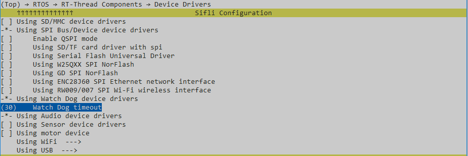

# WDT示例

源码路径：example/rt_device/wdt/wdt

## 支持的平台
<!-- 支持哪些板子和芯片平台 -->
+ em-lb525
+ em-lb587

## 概述
<!-- 例程简介 -->
本例程演示基于rt-device（使用rt-thread）的WDT使用，包含：
+ WDT开关。
+ WDT喂狗。
+ WDT超时响应。
```{tip}
本例程基于HCPU，使用到IWDT和WDT1。
```

## 例程的使用
<!-- 说明如何使用例程，比如连接哪些硬件管脚观察波形，编译和烧写可以引用相关文档。
对于rt_device的例程，还需要把本例程用到的配置开关列出来，比如PWM例程用到了PWM1，需要在onchip菜单里使能PWM1 -->

### 硬件需求
运行该例程前，需要准备一块本例程支持的开发板

### menuconfig配置

1. BSP使能WDT(同时自动配置`RT_USING_WDT`)：

2. 配置WDT超时时间(`WDT_TIMEOUT`)：


### 编译和烧录
切换到例程project目录，运行scons命令执行编译：
```
scons --board=eh-lb525 -j32
```
运行`build_em-lb525_hcpu\uart_download.bat`，按提示选择端口即可进行下载：
```
$ ./uart_download.bat

     Uart Download

please input the serial port num:5
```
关于编译、下载的详细步骤，请参考[](/quickstart/get-started.md)的相关介绍。

## 例程的预期结果
<!-- 说明例程运行结果，比如哪几个灯会亮，会打印哪些log，以便用户判断例程是否正常运行，运行结果可以结合代码分步骤说明 -->
例程启动后，串口输出如下：
1. WDT关闭再打开：
```c
11-01 11:05:24:772    WDT Example.
11-01 11:05:24:813    WDT off.
11-01 11:05:24:816    WDT on.
```
```{tip}
使用rt-thread时，WDT初始化配置、使能（rt_hw_watchdog_init）已经在启动流程中默认完成，不需要再单独调用初始化配置和使能。 
```
2. 取消idle线程中的喂狗：
```c
11-01 11:05:24:820    Unregister idle hook.
```
```{tip}
rt_hw_watchdog_init中注册了idle hook，用于喂狗。这里取消，用于示例主动喂狗。
```
3. 喂狗（每5秒）：
```c
11-01 11:05:29:709    watchdog feeding.
11-01 11:05:34:699    watchdog feeding.
11-01 11:05:39:668    watchdog feeding.
11-01 11:05:44:660    watchdog feeding.
11-01 11:05:49:629    watchdog feeding.
11-01 11:05:54:600    watchdog feeding.
11-01 11:05:59:594    watchdog feeding.
11-01 11:06:04:575    watchdog feeding.
11-01 11:06:09:558    watchdog feeding.
11-01 11:06:14:553    watchdog feeding.
```
3. 停止喂狗后，WDT1超时（`WDT_TIMEOUT`, menuconfig中配置），产生中断。中断中（`WDT_IRQHandler`）会将WDT1/WDT2关闭，刷新IWDT，更新IWDT超时时间（`WDT_TIMEOUT`）：
```c
11-01 11:06:14:557    Stop watchdog feeding.
11-01 11:06:51:813    WDT1 timeout occurs.
11-01 11:06:51:817    WDT reconfig:
11-01 11:06:51:821      WDT1 and WDT2 has been stopped.
11-01 11:06:51:825      IWDT refreshed and set timeout time to WDT_TIMEOUT.
```
```{tip}
提供了可复写函数：wdt_store_exception_information，wdt_store_exception_information被WDT_IRQHandler调用。可以用来保存现场、reboot系统等。
```
4. IWDT超时复位系统：
```c
11-01 11:07:35:237    SFBL
11-01 11:07:37:445    Serial:c2,Chip:4,Package:3,Rev:2  Reason:00000000
```


## 异常诊断

1. 通过WDT寄存器确认WDT配置状态（使能状态、计数配置、工作模式）：


## 参考文档
<!-- 对于rt_device的示例，rt-thread官网文档提供的较详细说明，可以在这里添加网页链接，例如，参考RT-Thread的[RTC文档](https://www.rt-thread.org/document/site/#/rt-thread-version/rt-thread-standard/programming-manual/device/rtc/rtc) -->

## 更新记录
|版本 |日期   |发布说明 |
|:---|:---|:---|
|0.0.1 |10/2024 |初始版本 |
| | | |
| | | |
